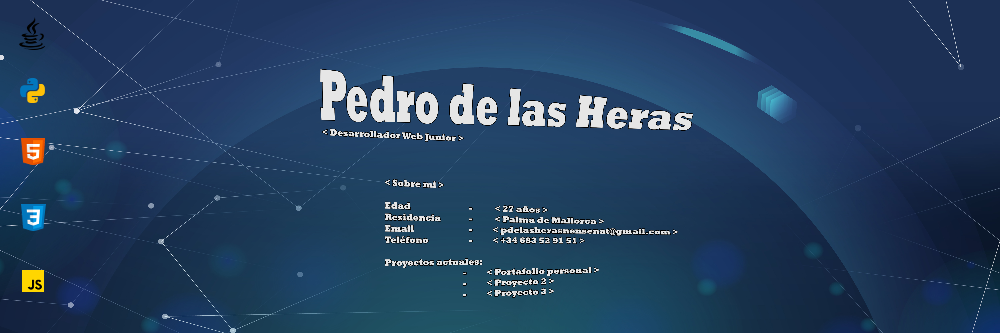

## Carta de Presentación 👋

### Biografía
Mi nombre es **Pedro de las Heras**, soy estudiante de un curso de Formación Profesional en el centro **CIFP Pau Casesnoves** en Inca, Mallorca.

Hace unos años, cansado de trabajar en diversos tipos de profesiones, me replanteé mi vida laboral. ¿Esto es lo que quiero? ¿No hay nada mejor? ¿A qué me gustaría dedicarme?
Nos hacen decidir sobre nuestro futuro muy temprano cuando ni siquiera sabemos qué es el mundo laboral, y te vas dejando llevar. Entonces te das cuenta de que estás en una situación que no te gusta y quieres cambiarla.
Aquí empieza mi aventura en el desarrollo de software.

Me decidí a estudiar programación, sin saber muy bien cómo, estaba perdido entre la multitud de opciones que había por internet. Recordé que había formaciones profesionales de informática y que habría posibilidades de que impartan estas lecciones.
Efectivamente, tras años de intentar entrar a un FP Superior, conseguí hace 3 años poder realizar un módulo del curso para poder obtener plaza preferente para los dos siguientes años, hasta día de hoy que estoy en la recta final del curso y poder 
ir a las prácticas para poder entrar a este mundo del cual me emociona.

### Desarrollo Front End
-  HTML5
-  CSS
-  Frameworks CSS (Bootstrap, Tailwind CSS, etc..)
-  Javascript

### Desarrollo Back End
-  Java
-  Python
-  Frameworks Python (Flask, Fastapi, Django,...)
-  Servidores DNS, Apache2, Tomcat, etc..

<!--
**PeteerDHeras/PeteerDHeras** is a ✨ _special_ ✨ repository because its `README.md` (this file) appears on your GitHub profile.

Here are some ideas to get you started:

- 🔭 I’m currently working on ...
- 🌱 I’m currently learning ...
- 👯 I’m looking to collaborate on ...
- 🤔 I’m looking for help with ...
- 💬 Ask me about ...
- 📫 How to reach me: ...
- 😄 Pronouns: ...
- ⚡ Fun fact: ...
-->
